# Enforce Tools (DayZ)

[Русская версия / Russian version](README.ru.md)

An **experimental IDE** for **DayZ Enforce Script** (EnScript) in VS Code — built on a
modded-aware project index and an in-process WASM parser. No external tools or processes:
open your mod, get completion, navigation, references, diagnostics and a real engine
compile check.

> ⚠️ **Beta** — the extension is under active development. Things may break or change
> between releases; feedback and bug reports are very welcome.

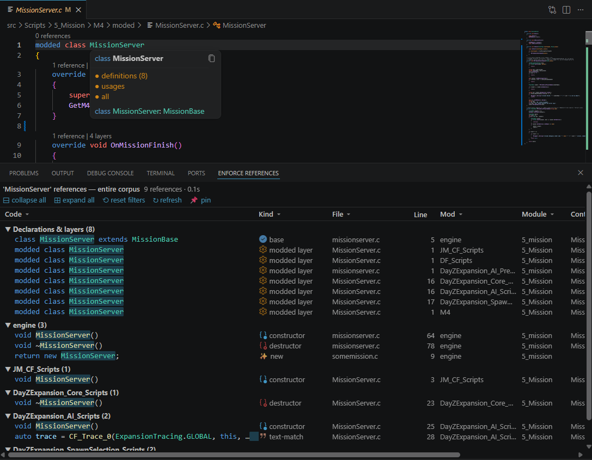

## Highlights

### Modded-aware index

Understands `modded class` layers, load order, inheritance (extends DAG), typedefs and
generics across your mod, its dependencies and the engine scripts. Cold start on a large
corpus (engine + Expansion + CF, ~5000 files) takes a few seconds; warm start from cache
is ~200 ms.

### Type-aware completion

Members of the receiver's *resolved* type — call chains (`GetGame().CreateObject().`),
generics (`array<MyCfg>` → one `Insert`, not 38 same-named candidates), `auto` inference,
`foreach` variables. Every suggestion shows the class it comes from and how many modded
layers it has; members hidden by inactive `#ifdef` guards are cut (or shown struck-through).

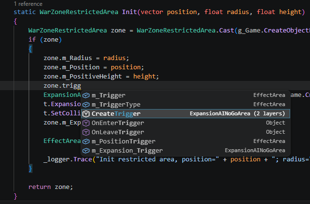

### Hover / Go to Definition

Resolved semantically by receiver type, not by name. Popups show colorized **clickable**
signatures (every type and name is a link), the owning class, script module and mod,
modded layers, derived overrides, and `super` resolution that follows the real
modded-layer chain.

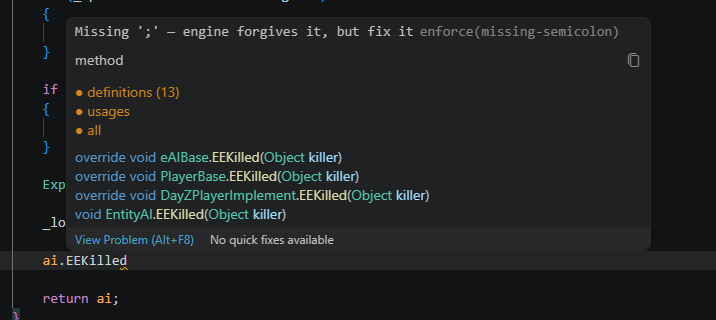

### References panel

`Shift+F12` opens a Visual Studio-style bottom panel: a declarations & layers group on top
(base / modded layer / override / inherited), then usages classified as call / read /
write / constructor / text-match, with per-column filters, resizable columns,
mod / module / containing-member columns, group collapse, result pinning to a separate
tab and virtualized rendering for 10k+ rows. Virtual dispatch is tracked: a call through
a base-class reference is reported on the override with a `?` mark.

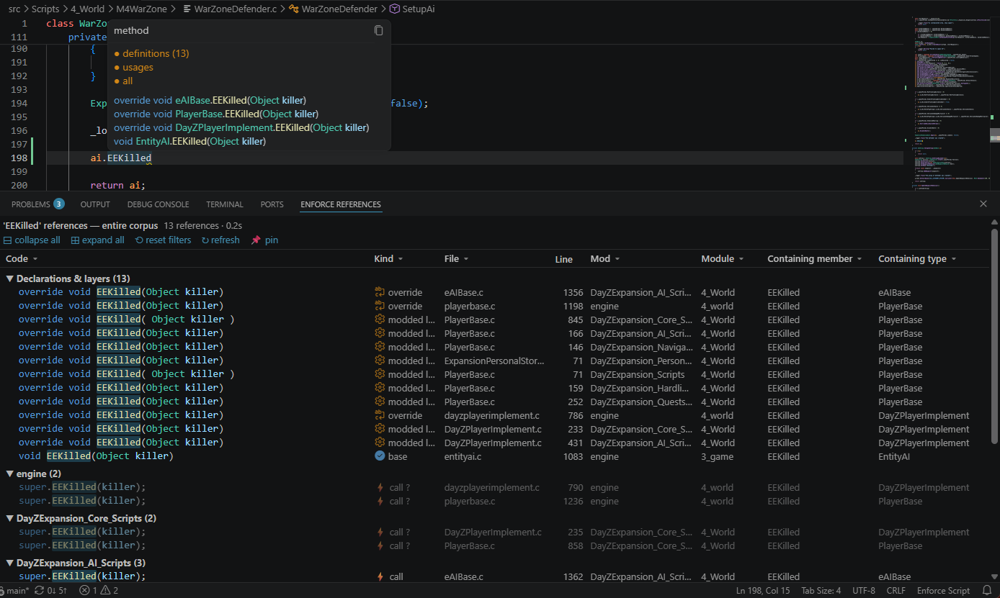

Enum members are first-class citizens — every value gets its own reference count,
including string literals used by MVC-style bindings (text-match):

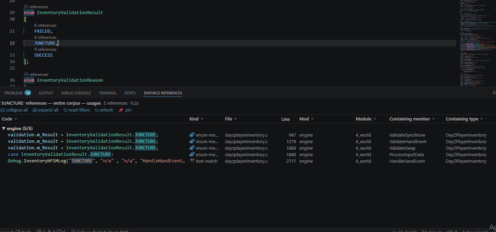

### CodeLens & semantic highlighting

"N references" / "N layers" above declarations, index-driven semantic colors, and dead
`#ifdef` regions dimmed according to your project defines.

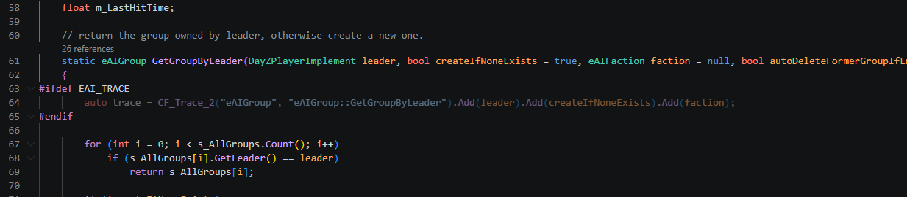

References work on engine and dependency sources too (opt-in `externalReferences` flag —
scans the whole corpus):

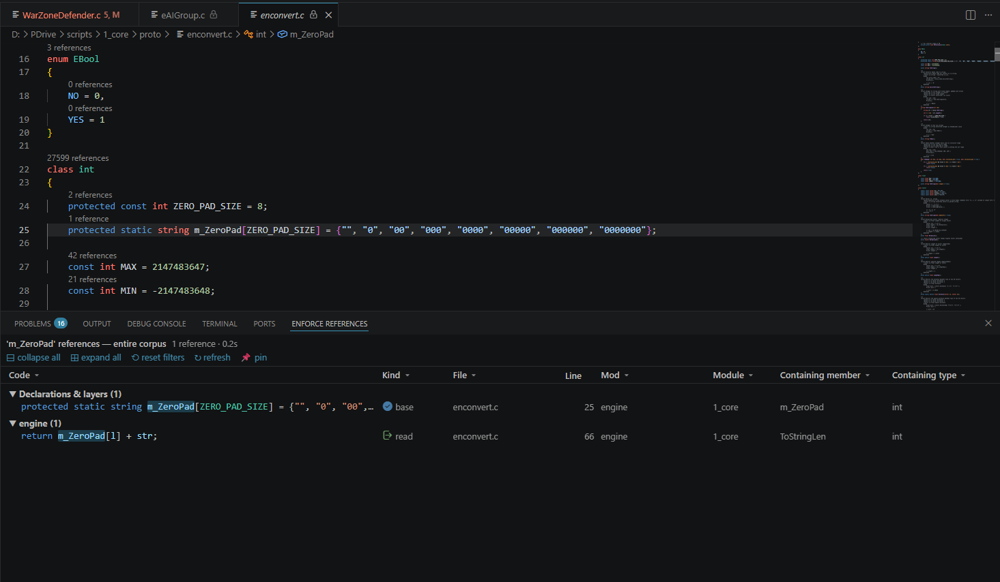

### Signature Help

Overloads with the active parameter highlighted as you type:

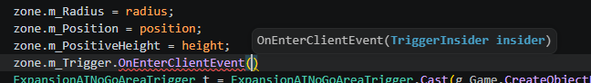

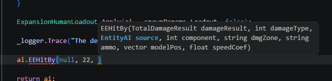

### Diagnostics on save

Parse errors are tuned to what the engine actually rejects: the ternary operator is an
error, a missing `;` is only a warning (the engine forgives it). A semantic pass reports
undeclared methods/functions, unknown types, call arity mismatches and extra generic
arguments (which the engine silently ignores — a known vanilla pitfall).

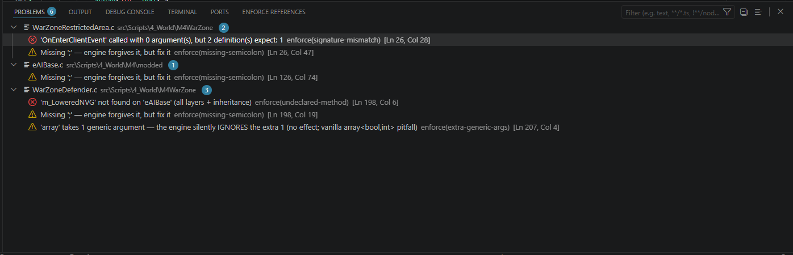

### Engine build check

`F5` packs your mod into a PBO (built-in packer, no AddonBuilder) and runs a headless
DayZ Server compile: the **real** compiler's verdict in ~10 s. Root causes are separated
from cascade errors, everything is mapped back to your source files in the Problems
panel, and the real engine defines are printed (importable into the manifest).
`Ctrl+Shift+B` = pack PBO only.

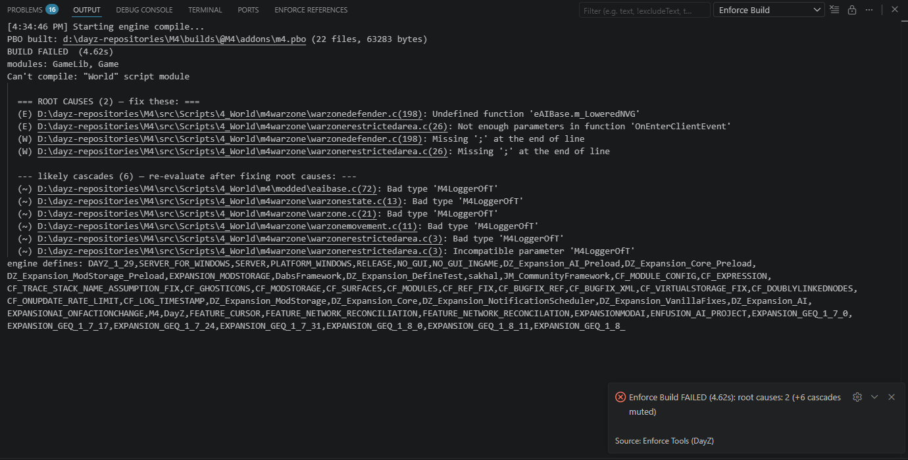

## Requirements

- **DayZ Tools** with the Work Drive (`P:`) mounted, or any local copy of the unpacked
  engine scripts (`scripts/1_Core` … `5_Mission`).
- A project manifest `enforce.project.json` in the workspace root (see below).
- For the build check: a locally installed DayZ Server (auto-detected via Steam paths,
  or set explicitly).

## Quick start

Minimal `enforce.project.json` (engine on `P:`, no dependencies):

```jsonc
{}
```

Yes, an empty object works: the engine is taken from `P:/scripts`, the mod root is
discovered via `config.cpp` next to the manifest. Add dependencies as you need them —
see the full reference below.

## Commands

| Command | Description |
| --- | --- |
| `Enforce: Find All References (Panel)` | References panel for the symbol under the cursor (`Shift+F12`) |
| `Enforce: Rebuild Index` | Force a full reindex (drops the disk cache) |
| `Enforce: Show All Modifications (discovery)` | All modded layers of a class |
| `Enforce: Build Check (Engine Compile)` | PBO + headless engine compile (`F5`) |

## Settings

| Setting | Default | Description |
| --- | --- | --- |
| `enforce.workDrive` | `P:` | DayZ Tools Work Drive with unpacked engine scripts |
| `enforce.parseDiagnostics` | `warning` | Parse diagnostics: warning / error / off |
| `enforce.semanticDiagnostics` | `warning` | Semantic diagnostics: warning / error / off |
| `enforce.conditionalMembers` | `hide` | Members with false `#ifdef` guard: hide / dim |
| `enforce.codeLensReferences` | `true` | "N references" CodeLens above declarations |
| `enforce.readonlyExternal` | `true` | Open engine/dependency sources read-only |
| `enforce.autoRefreshSeconds` | `300` | Background revalidation of external roots (0 = off) |
| `enforce.build` | — | Build gate defaults (overridden by `build{}` in the manifest) |

## Full configuration reference

A maximally filled `enforce.project.json` — custom engine location, custom DayZ Server,
dependencies, explicit project roots, defines and the build gate:

```jsonc
{
  // ---- engine scripts -------------------------------------------------------
  // Custom location of the unpacked base game scripts (the folder that contains
  // 1_Core, 2_GameLib, 3_Game, 4_World, 5_Mission).
  // Omit the key entirely to use the default: <workDrive>/scripts (P:/scripts).
  // ${WORKDRIVE} expands to the enforce.workDrive VS Code setting.
  "engine": "E:/DayZ/WorkDrive/scripts",
  // "engine": "${WORKDRIVE}/scripts",        // equivalent of the default

  // ---- preprocessor defines -------------------------------------------------
  // Controls #ifdef guard evaluation: member filtering in completion, dead-region
  // dimming, diagnostics suppression. The build check prints the REAL define list
  // of your engine ("engine defines: ..." in the output) — copy it here.
  // true = defined, false = explicitly undefined. A define NOT listed here is
  // treated as undefined (strict, same as the engine preprocessor).
  "defines": {
    "PLATFORM_WINDOWS": true,
    "SERVER": true,
    "RELEASE": true,
    "DAYZ_1_29": true,
    "JM_CommunityFramework": true,
    "DabsFramework": true,
    "DZ_Expansion_Core": true,
    "DZ_Expansion_AI": true,
    "DIAG": false
  },

  // ---- dependency mods (script sources, in load order) ----------------------
  // Each entry is a root with mod SOURCES (not packed PBOs). A root containing
  // several config.cpp mods (like DayZ-Expansion-Scripts) is auto-split into
  // per-mod layers. Relative paths resolve against the manifest folder.
  "load": [
    { "name": "CF",        "path": "D:/mods/DayZ-CommunityFramework/JM/CF", "role": "dependency" },
    { "name": "DABS",      "path": "D:/mods/DayZ-Dabs-Framework/DabsFramework", "role": "dependency" },
    { "name": "Expansion", "path": "D:/mods/DayZ-Expansion-Scripts", "role": "dependency" }
  ],

  // ---- project roots (your own code) ----------------------------------------
  // Optional. Omit → the manifest folder itself is the project root and mods are
  // discovered by config.cpp. Set explicitly when sources live elsewhere:
  "project": [
    { "name": "MyMod", "path": "./src" }
  ],

  // ---- references scope -----------------------------------------------------
  // true → CodeLens / hover / Shift+F12 also work on engine and dependency files
  // (whole-corpus scans; popular engine types can have thousands of usages).
  // false/omitted → references are scanned in project files only (cheap).
  "externalReferences": true,

  // ---- engine build gate (F5) -----------------------------------------------
  "build": {
    // PBO packaging
    "modName": "@MyMod",            // output mod folder name (default: @<manifest folder>)
    "prefix": "MyMod",              // PBO prefix; MUST match CfgMods files[] ("MyMod/Scripts/...")
    "outDir": "./builds",           // artifact: <outDir>/<modName>/addons/<prefix>.pbo

    // packed dependency mods for -mod= (workshop or local @folders, load order)
    "deps": [
      "D:/Steam/steamapps/common/DayZ/!Workshop/@CF",
      "D:/Steam/steamapps/common/DayZ/!Workshop/@Dabs Framework",
      "D:/Steam/steamapps/common/DayZ/!Workshop/@DayZ-Expansion-Core",
      "D:/Steam/steamapps/common/DayZ/!Workshop/@DayZ-Expansion-AI"
    ],

    // Custom DayZ Server location. Omit both → auto-detect via standard Steam
    // paths. DayZServer_x64.exe (standalone) is required — DayZDiag needs a
    // running Steam client and is not used.
    "serverExe": "E:/Games/SteamLibrary/steamapps/common/DayZServer/DayZServer_x64.exe",
    "serverCwd": "E:/Games/SteamLibrary/steamapps/common/DayZServer",

    // Mission used for the compile run (relative to serverCwd or absolute).
    "mission": "mpmissions/dayzOffline.chernarusplus",

    // Hard timeout of one compile run, seconds.
    "timeoutSec": 240
  }
}
```

Notes:

- **Windows path style**: both `/` and `\\` work in the manifest; the engine itself is
  fed backslash paths automatically.
- `build{}` in the manifest overrides the `enforce.build` VS Code setting key-by-key.
- The compile verdict comes from the actual engine binary, so it is exactly what players'
  clients/servers will say.

## License

MIT
